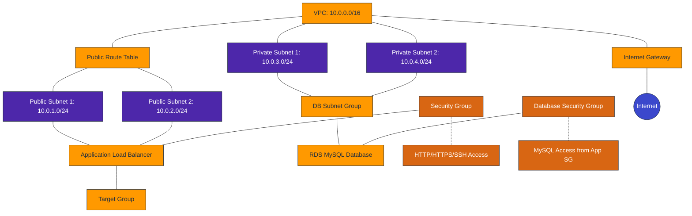

# Infrastructure Diagram

This diagram visualizes the AWS resources that will be created by the CloudFormation template.

## Architecture Overview

This CloudFormation template creates a highly available architecture with the following components:

1. **Networking**:
   - VPC with CIDR block 10.0.0.0/16
   - 2 Public subnets in different Availability Zones
   - 2 Private subnets in different Availability Zones
   - Internet Gateway for public internet access
   - Route tables for network traffic management

2. **Security**:
   - Security group for the application layer (HTTP/HTTPS/SSH access)
   - Security group for the database (MySQL access from application security group)

3. **Application Layer**:
   - Application Load Balancer distributing traffic across availability zones
   - Target Group for the load balancer

4. **Database Layer**:
   - MySQL RDS instance in private subnets
   - DB Subnet Group spanning multiple availability zones for high availability

This architecture follows AWS best practices by separating public-facing components in public subnets and sensitive data in private subnets, while providing high availability through multi-AZ deployment.